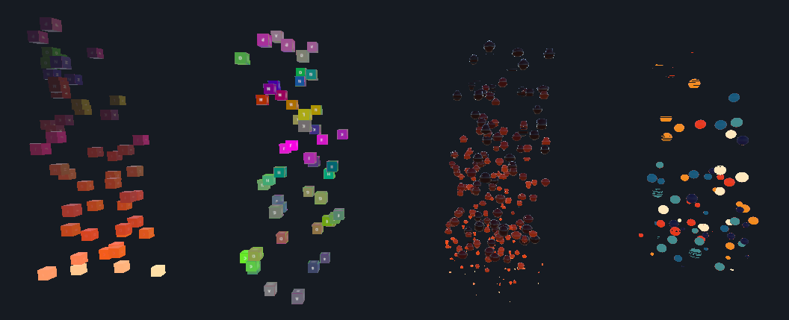
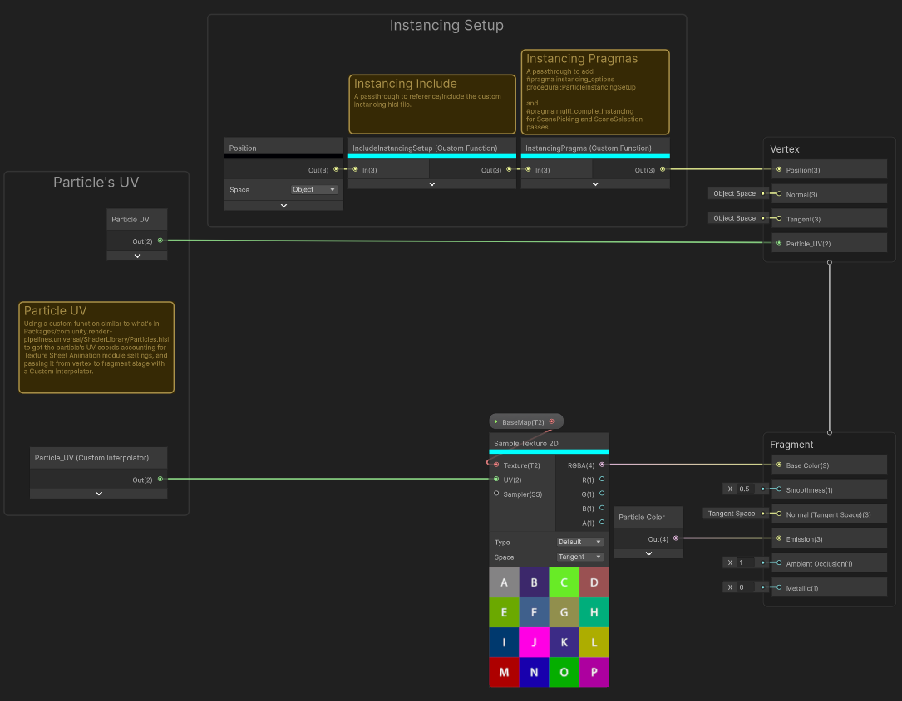

# Shuriken Particles - Shader Graph Examples
Shuriken Particles examples using Shader Graph

This package contains examples of Shuriken Particles using Shader Graph and GPU Instancing.

From left to right:

### URP Only
Those shader graphs demonstrate how to support GPU Instancing leveraging URP's default Particle Instancing.

#### Simple
This shader graph demonstrates the basic implementation or URP's Particle Instancing.
It supports flipbook UVs provided by the Texture Sheet Animation module and particle's color.

#### Flipbook Blending
This shader graph demonstrates the implementation of a custom particle data struct with Custom Vertex Stream, to support flipbook blending provided by the Texture Sheet Animation module as explained in the documentation.

#### Age & Speed
This shader graph demonstrates the implementation of a custom particle data struct with Custom Vertex Stream, to fetch particles' age and speed attributes.

#### Stable Random & Custom
This shader graph demonstrates the implementation of a custom particle data struct with Custom Vertex Stream, to fetch particles' stable random and custom attributes.

### Cross Pipeline
More examples will be added, using a render pipeline agnostic setup.

### Shuriken Mesh Tool
To use a mesh with Shuriken Particles, it must have only one submesh.
And to use it with Flipbook Blending, its UV1 must be the same as UV0.
This tool allows creating a Shuriken ready mesh from any other mesh.

To use it, go to
>Window/Shuriken Particles/Mesh Tool.
