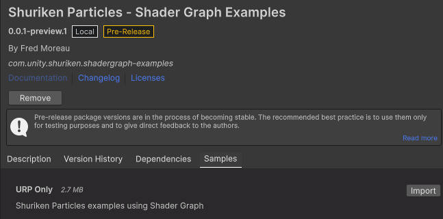

# Shuriken Particles - Shader Graph Examples
Shuriken Particles examples using Shader Graph

This package contains examples of Shuriken Particles using Shader Graph and GPU Instancing.

## Setup

### Disclaimer
Just a heads-up: this stuff is for your research and personal tinkering only. Use it at your own risk – I won't be maintaining or supporting it, and I can't be held responsible for anything that happens from using it.

### Install through the Package Manager
1. Go to Window/Package Manager.
2. Click on the + icon and select "Add package from git URL...".
2. Copy/paste the following url in the field and click on Add. (This requires Git installed)
- git@github.com:FredMoreau/Shuriken-Particles-Shader-Graph-Examples.git
- You can also download the repo as a Zip file, unzip it somewhere like C://Unity_Custom_Packages/, then from the Package Manager select Add package from disk, and browse for the package.json file.

## Package Samples
The package features sample(s), available from the Package Manager.

### URP Only
Those shader graphs demonstrate how to support GPU Instancing leveraging URP's default Particle Instancing.

#### Simple
This shader graph demonstrates the basic implementation or URP's Particle Instancing.
It supports flipbook UVs provided by the Texture Sheet Animation module and particle's color.

#### Flipbook Blending
This shader graph demonstrates the implementation of a custom particle data struct with Custom Vertex Stream, to support flipbook blending provided by the Texture Sheet Animation module as explained in the documentation.

#### Age & Speed
This shader graph demonstrates the implementation of a custom particle data struct with Custom Vertex Stream, to fetch particles' age and speed attributes.

#### Stable Random & Custom
This shader graph demonstrates the implementation of a custom particle data struct with Custom Vertex Stream, to fetch particles' stable random and custom attributes.

### Cross Pipeline Simple
Same as URP Only but made compatible with HDRP with a simple hack.

### Cross Pipeline Advanced
Same examples but using a RP agnostic custom include with no hack.

### Shuriken Mesh Tool
To use a mesh with Shuriken Particles, it must have only one submesh.
And to use it with Flipbook Blending, its UV1 must be the same as UV0.
This tool allows creating a Shuriken ready mesh from any other mesh.

To use it, go to
>Window/Shuriken Particles/Mesh Tool.
